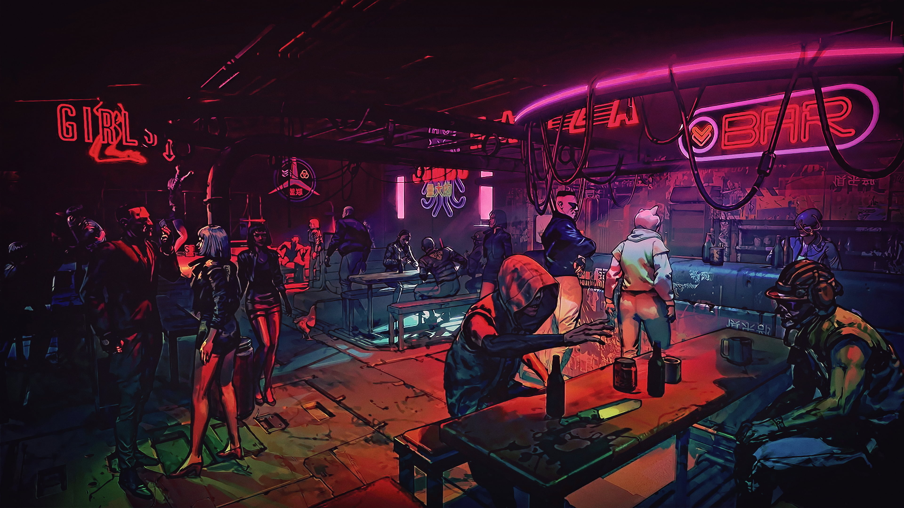

# Decks

<figure><figcaption></figcaption></figure>

Lorem

**Lorem Ipsum** é simplesmente uma simulação de texto da indústria tipográfica e de impressos, e vem sendo utilizado desde o século XVI, quando um impressor desconhecido pegou uma bandeja de tipos e os embaralhou para fazer um livro de modelos de tipos. Lorem Ipsum sobreviveu não só a cinco séculos, como também ao salto para a editoração eletrônica, permanecendo essencialmente inalterado. Se popularizou na década de 60, quando a Letraset lançou decalques contendo passagens de Lorem Ipsum, e mais recentemente quando passou a ser integrado a softwares de editoração eletrônica como Aldus PageMaker.

<table data-view="cards"><thead><tr><th></th><th align="center"></th><th></th></tr></thead><tbody><tr><td>CARD1</td><td align="center"></td><td></td></tr><tr><td></td><td align="center">CARD2</td><td></td></tr><tr><td>CARD3</td><td align="center"></td><td></td></tr></tbody></table>
